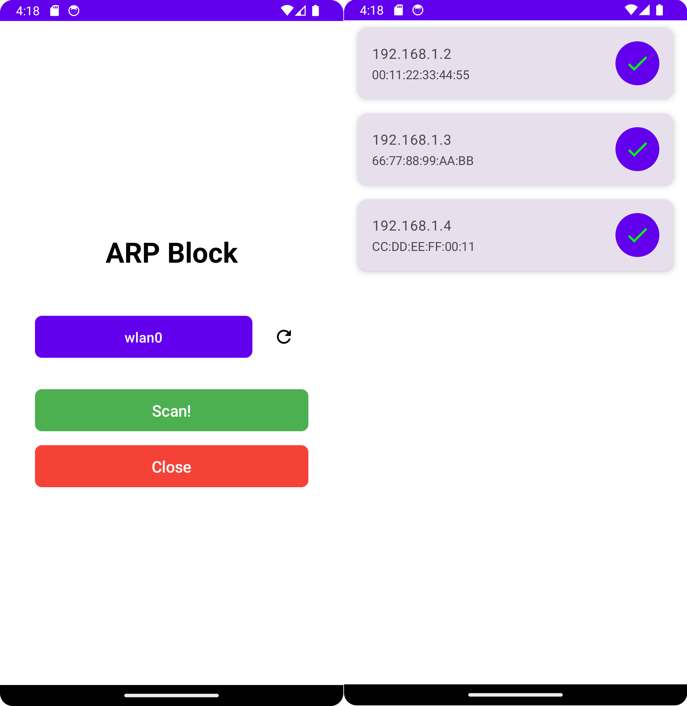

# ARPBlock

ARPBlock is an Android application designed to scan and manage devices on a local network using ARP (Address Resolution Protocol). The app allows users to scan the network to find connected devices and perform actions such as blocking or unblocking them.



## Features

- **Network Scanning**: Scan the local network to discover connected devices.
- **Device Management**: Block or unblock devices on the network.
- **Real-time Updates**: Receive real-time updates of device statuses.

## Activities

### MainActivity

The `MainActivity` is the entry point of the application. It provides an interface for selecting a network interface, refreshing the list of interfaces, and starting a network scan.

#### Key Components

- **Interface Selection**: Allows the user to select a network interface from a dropdown menu.
- **Refresh Button**: Refreshes the list of available network interfaces.
- **Scan Button**: Initiates the network scan process.
- **Close Button**: Exits the application.

### ScanActivity

The `ScanActivity` handles the network scanning process. It sends ARP requests to discover devices and displays them in a list. Users can block or unblock devices directly from this activity.

#### Key Components

- **Device List**: Displays a list of discovered devices on the network.
- **Scan Button**: Initiates a new scan.
- **Block/Unblock Button**: Allows users to block or unblock devices.

## Installation

1. Clone the repository:
    ```sh
    git clone https://github.com/yourusername/arpblock.git
    ```
2. Open the project in Android Studio.
3. Build and run the project on your Android device.

## Usage

1. **Select Network Interface**: Open the app and select the network interface you want to scan.
2. **Refresh Interfaces**: Use the refresh button to update the list of available network interfaces.
3. **Start Scan**: Click the scan button to start scanning the network for connected devices.
4. **Manage Devices**: View the list of discovered devices. Use the block/unblock button to manage the devices.

## Contributing

Contributions are welcome! Please create an issue or submit a pull request for any enhancements or bug fixes.

## License

This project is licensed under the MIT License - see the [LICENSE](LICENSE) file for details.